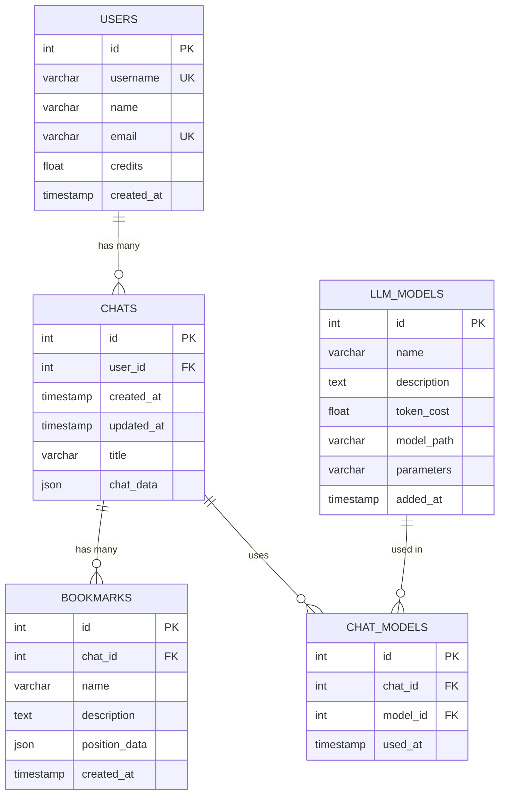

# Beep Boop Chat Database ER Diagram

## Entity-Relationship Diagram

## Database Schema Description

### USERS

- Stores user information and credit balance
- Each user has a unique username and email
- Credits are stored as float values and used for model usage

### LLM_MODELS

- Stores available language models
- Includes model name, description, and token cost
- Pre-populated with three models with different credit costs:
  1. phi-4-mini-instruct (0.5 credits per chat)
  2. gemma-3-4b-it (1.0 credits per chat)
  3. deepseek-r1-distill-qwen-7b (1.5 credits per chat)

### CHATS

- Stores chat history for each user
- Includes timestamps and chat data in JSON format
- Links to user through user_id foreign key
- Each chat has a title (which can be derived from the first message)

### CHAT_MODELS

- Junction table that tracks which models were used in each chat
- Implements a many-to-many relationship between CHATS and LLM_MODELS
- Helps in credit calculation and usage tracking
- Records timestamp when a model was used in a chat

### BOOKMARKS

- Allows users to bookmark specific points in chats
- Limited to 10 bookmarks per chat (enforced by a database trigger)
- Stores position data in JSON format
- Contains a name and optional description for each bookmark

## Constraints and Business Rules

1. **User Uniqueness**: Username and email must be unique across all users
2. **Bookmark Limit**: Maximum of 10 bookmarks per chat (enforced by a database trigger)
3. **Referential Integrity**: Foreign key constraints ensure data consistency
   - When a user is deleted, all their chats are deleted (CASCADE)
   - When a chat is deleted, all its bookmarks and chat_model entries are deleted (CASCADE)
4. **Credit System**: Users must have sufficient credits to use models based on their token_cost

## Indexes

- Primary keys on all tables
- Foreign keys for relationships
- Fulltext index on chat_data for better performance
- Index on chat_id in BOOKMARKS table to support the bookmark limit trigger
